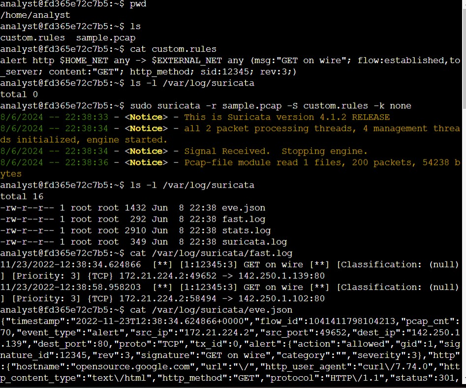

# Hello, I'm Vince

I am a current graduate student who's always had an interest in computer tech and problem-solving.

(Please navigate to the "master" branch for codes)

## Objective

My goal is to stay updated and current in my knowledge within the world of computing and technology. I also created this portfolio to demonstrate my learning and knowledge in progress.

## Skills

| Skill                                         | Associated Project         |
|-----------------------------------------------|----------------------------|
| Suricata                                      | |
| Applying filters to SQL query                 |[Apply filters to SQL queries](assests/Apply_filters_to_SQL_queries.pdf)|
| Security Automation                           |[File permissions in Linux](assests/File_permissions_in_Linux.pdf)|
| Incident Response Planning and Execution      | SOC Automation Lab|
| Wireshark                                     | SOC Automation Lab|
| Scripting                                     | SOC Automation Lab|
